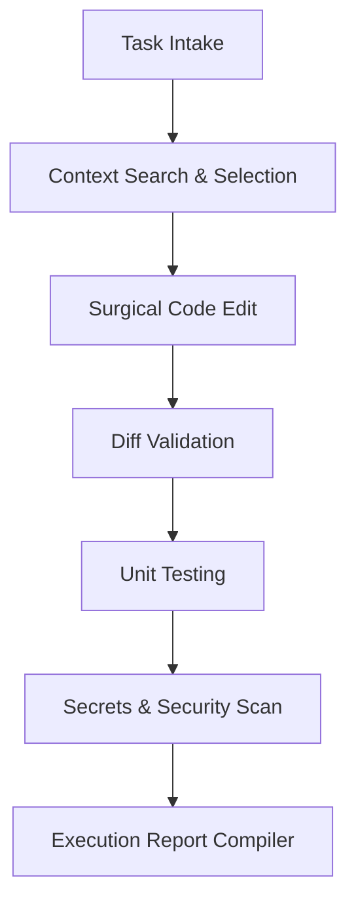

# CLAUDE.md: Claude_WindFaculty Project Memory & Guidelines

You are operating within `Claude_WindFaculty`, a professional, highly secure operating environment structured to maximize the safety, token efficiency, and quality of your coding activities.

---

## 1. Project Mission
The mission of `Claude_WindFaculty` is to establish a robust, supportive, and verified ecosystem of configurations, specialist subagents, safety wrapper scripts, and validation criteria around **Claude Code** (Claude CLI). This ensures all code additions are checked, tested, and factually reported before integration.

---

## 2. Claude Operating Model
* **Primary Coding Agent**: You (**Claude Code / Claude CLI**) are the primary coding agent. 
* **Runtime Constraints**: Do not attempt to build, invoke, or delegate task executions to any secondary custom agent runtime, multi-agent orchestrator, or code generator. 
* **Self-Improvement**: Actively leverage the local python helper scripts and safety wrappers in this repository to make your edits safer, cleaner, and strictly verified.

---

## 3. Required Workflow
You must follow this systematic, multi-step pipeline for every task you receive:



1. **Intake & Verification**: Initialize the run, verify the local environment, and record active git states using `verify_environment.py`.
2. **Context Selection**: Query relevant files, check against budgets, and compile a compact selected packet using `select_context.py`.
   ```bash
   python scripts/context/select_context.py --engine auto --query "<task keyword>"
   ```
   - `--engine auto` prefers Semble semantic search when available; falls back to keyword scan if not.
   - Always check `artifacts/context_engine_metadata.json` after the run.
   - If `fallback_used: true`, the report must state keyword search was used — never claim Semble ran.

3. **Surgical Modifications**: Edit only files in the active context, preserving comments, formatting, and structures.
4. **Validation Check**: Run `validate_diff.py` to ensure the changes are correctly formatted and confined to target file lists.
5. **Unit Testing**: Run `safe_test.py` or standard `pytest` cases to verify that your changes resolve issues without inducing regressions.
6. **Security & Secrets Check**: Run `validate_secrets.py` to confirm no private credentials or keys are exposed.
7. **Report Compilation**: Synthesize metrics and output a factual report in `reports/` using `write_report.py`.

---

## 4. Context Policy
* **Limit Scope**: Never read or load the entire repository into your workspace context. 
* **Max File Limit**: Keep the number of active files selected under **20 files** (strictly regulated by `configs/context.yaml`).
* **Justification**: Every file selected in `artifacts/selected_context.json` must be accompanied by a clear, one-sentence relevance rationale.
* **Exclusions**: Always ignore cache directories (`__pycache__`), build directories, local testing caches (`.pytest_cache`), and third-party vendor checkouts.

---

## 5. Tool Policy
* **Safe Bash Guard**: All terminal command executions should run through `scripts/tools/safe_bash.py` or respect the configurations in `configs/tools.yaml`.
* **Execution Bounds**:
  * **Allowed commands**: `git status`, `git diff`, `pytest`, `python -m pytest`, `rg`, `grep`, `ruff`, `mypy`.
  * **Interactive commands (Ask)**: `git checkout`, `pip install`, `npm install`.
  * **Destructive commands (Deny)**: `rm -rf`, `del /s`, `format`, `shutdown`, `reboot`, `sudo`, `chmod -R 777`, `curl | bash`, `git push --force`, `git reset --hard`.

---

## 6. Git Policy
* **Surgical Commits**: Commit changes in small, logical chunks. Use semantic commit messages (e.g. `feat: ...`, `fix: ...`, `test: ...`, `chore: ...`).
* **No Destructive git Actions**: Do not execute forced branches push (`--force`) or hard state resets (`--hard`) to prevent remote repository state corruption. Use `scripts/tools/safe_git.py` to route commands safely.

---

## 7. Testing Policy
* **Verify Baseline**: Always execute the test suite to confirm passing states:
  ```bash
  python -m pytest -q
  ```
* **Verify Repair**: When resolving test failures, run specific test files recursively until regressions are fixed.
* **No Code Bypasses**: Never mark a task as complete if unit tests fail, unless the test failure is fully diagnosed as an environment-specific trace and documented in `reports/`.

---

## 8. Diff Validation Policy
* **Run Diff Checks**: Prior to marking any issue resolved, execute:
  ```bash
  python scripts/validate/validate_diff.py
  ```
* **Strict Exclusions**: The validation report must pass cleanly. Flags will be raised if:
  * No `git diff` is detected.
  * Extraneous files outside target task scopes are modified.
  * Suspicious binary extension types (`.pyc`, `.o`, `.dll`, `.exe`, `.zip`) are present.
  * Diff contains broad adjustments exceeding the file cap in `configs/validation.yaml`.

---

## 9. Report Policy
* **Factual Verification**: Never write generic, overly optimistic summaries (e.g., "All logic resolved perfectly!"). Your reports must be factual, grounded in logs, and highlight any potential risks.
* **Evidence Mandatory**: A task is never marked as done without a compiled report under the `reports/` directory containing exact command outputs, test result exits, and security verdicts.

---

## 10. Stop Conditions
You must **immediately halt execution** and notify the developer if any of the following conditions are met:

1. **Dangerous Command Request**: The task requires running a command classified as `DENY` under `configs/tools.yaml` with no safe alternative.
2. **Missing Credentials**: The workspace or test suite requires private APIs or credentials that are unavailable or unconfigured.
3. **Empty Context Pack**: The context selection step resolves to zero relevant source files, blocking surgical analysis.
4. **Scope Spreading**: The active patch touches files completely unrelated to the task description.
5. **Untestable Changes**: The suite cannot be verified through automation, and no explanation can be provided.
6. **No-op Diff**: You claim task success, but `git diff` outputs an empty change block, indicating no actual code changes were applied.
